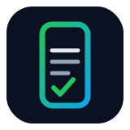
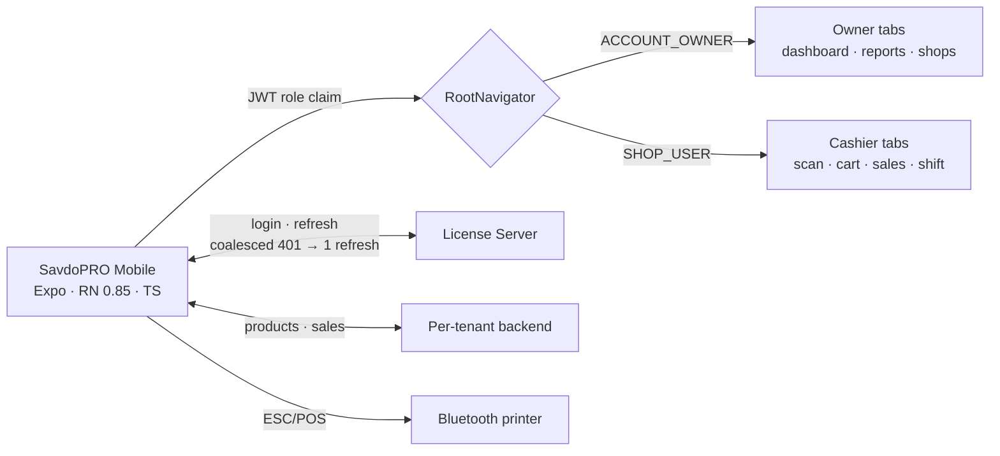

<p align="center">
  
</p>

<h1 align="center">SavdoPRO Mobile</h1>

<p align="center"><strong>The iOS + Android companion for SavdoPRO POS — role-aware cashier and owner back office.</strong></p>

<p align="center">
  <a href="https://github.com/SarvarUrinboyev/savdopro-mobile/actions/workflows/quality.yml"></a>
  
  
  
  
  
</p>

iOS + Android companion app for the **SavdoPRO** desktop POS ([savdopro](https://github.com/SarvarUrinboyev/savdopro)). Built with **Expo SDK 56 + React Native 0.85 + TypeScript**. The app reuses the desktop's centralized **License Server** for auth — no account, brand, or user logic is duplicated on the mobile side; all other data (products, sales, customers) is served by the per-tenant local backend. **In-flight token refreshes are coalesced** so 20 parallel 401s trigger exactly one refresh.



## Roles

The same app serves two roles based on the JWT `role` claim:

| Role            | Tabs                                                         |
| --------------- | ------------------------------------------------------------ |
| `ACCOUNT_OWNER` / `SUPER_ADMIN` | Bosh sahifa · Hisobotlar · Do'konlar · Mijozlar · Sozlamalar |
| `SHOP_USER` (cashier)            | Skan · Savatcha · Sotuvlar · Smena · Sozlamalar              |

## Project layout

```
src/
├── api/
│   ├── licenseClient.ts   # fetch wrapper + refresh-on-401 + LicenseError
│   └── endpoints.ts       # AuthApi (login, refresh, logout, me, totp/*)
├── auth/
│   └── AuthContext.tsx    # useAuth() — session state + login/logout
├── navigation/
│   ├── RootNavigator.tsx  # Login | OwnerTabs | CashierTabs by role
│   ├── OwnerTabs.tsx
│   └── CashierTabs.tsx
├── screens/
│   ├── LoginScreen.tsx
│   ├── PlaceholderScreen.tsx
│   ├── owner/             # Dashboard, Reports, Shops, Customers
│   └── cashier/           # Scan, Cart, Sales, Shift
├── storage/
│   └── mmkv.ts            # MMKV instance + key constants
├── theme/
│   └── brand.ts           # white-label colour overrides + useColors()
└── types/
    └── auth.ts            # mirrors AuthDtos.java
```

## Running

> **Heads-up:** the project uses `react-native-mmkv`, which requires a custom
> dev client — Expo Go won't load it. Use one of the two flows below.

### Option A — EAS Build (no Android SDK needed, free)

```bash
npm install -g eas-cli
eas login                       # one-time, free Expo account
eas build --profile preview --platform android
# Scan the QR code from the build URL → installs the APK on your phone
```

### Option B — local Android build (requires Android Studio + SDK)

```bash
npx expo run:android
```

### Backend connectivity

The License Server URL defaults to `http://<your-lan-ip>:9090` (development machine's LAN
IP). The phone and the laptop **must be on the same Wi-Fi**. To change it, edit
the field on the Login screen — the value persists in MMKV.

## Auth contract

The mobile client is a port of `barakat-supermarket/frontend/src/api/licenseClient.js`:

- `POST /api/auth/login` → `{token, refreshToken, accessExpiresInSec, user}`
- `POST /api/auth/refresh` rotates both tokens; in-flight refreshes are
  coalesced so 20 parallel 401s trigger only one refresh.
- `POST /api/auth/logout` is best-effort (refresh-token revoke).
- `GET /api/auth/me` returns the session + embedded brand colours.

## Tests

```bash
npm test   # tsx + node:test  → 8 tests
```

Unit tests cover the pure display/formatting layer (`src/lib/format.ts`): currency-aware money formatting (USD/UZS), thousands separators, ISO→`DD.MM.YYYY` date/time, Uzbek duration strings, and payment-method labels. They run in CI on every push (`quality.yml`: type-check + tests). No native toolchain required.

## Next milestones

1. **Push notifications** — `POST /api/devices/register` + FCM (backend +
   client). Currently Telegram-only alerts on the desktop side.
2. **Barcode scan flow** — `expo-camera` → product lookup → cart.
3. **Bluetooth ESC/POS** — print receipts from `react-native-bluetooth-classic`.
4. **App Store + Play Store** — pending Apple Developer ($99/yr) and Google Play
   ($25 one-time) account purchases.

Bundle ID / Application ID: `uz.barakat.savdopro`.
